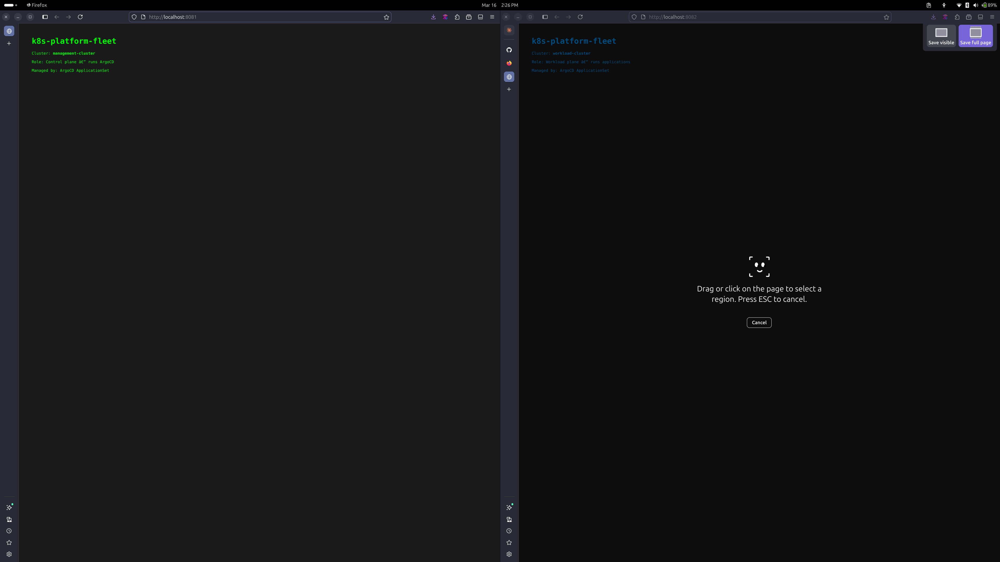

# k8s-platform-fleet

A multi-cluster Kubernetes platform demonstrating how platform engineering teams manage application fleets at scale. One ArgoCD instance on a management cluster controls deployments across all registered clusters — add a new cluster to a list and it automatically receives every application, correctly configured for its environment.

> Built to demonstrate platform engineering practices relevant to hyperscaler operations (Oracle Cloud, Ctrls). The mental model mirrors managing thousands of KVM hypervisors — consistent desired state enforced automatically across a fleet, with environment-specific overrides per target.

---

## Screenshot

### One ApplicationSet, two clusters, different configs — deployed automatically



Left: `management-cluster` (green) — runs ArgoCD, acts as the control plane.  
Right: `workload-cluster` (blue) — runs applications, managed remotely by ArgoCD.

Same Git repo. Same ApplicationSet. Environment-specific config applied automatically via Kustomize overlays.

---

## How it works

```
Git repo (source of truth)
        │
        │  ArgoCD watches for changes
        ▼
management-cluster
├── ArgoCD (control plane)
│   └── ApplicationSet
│       ├── generates Application → management-cluster (in-cluster)
│       └── generates Application → workload-cluster (remote)
│
├── sample-app (management overlay — green)
│
workload-cluster (registered as remote target)
└── sample-app (workload overlay — blue)
```

**ApplicationSet** is the key component. Instead of manually creating one ArgoCD `Application` per cluster, you define a single `ApplicationSet` with a list of target clusters. ArgoCD automatically generates one `Application` per cluster, each pointing to the correct Kustomize overlay for that environment.

Adding a third cluster is one change — add an entry to the list in `applicationsets/sample-app.yaml` and push. ArgoCD handles the rest.

---

## Architecture

```
┌─────────────────────────────────────────────────────────────┐
│  management-cluster (minikube)                               │
│                                                              │
│  ┌──────────────────────────────────────────────────────┐   │
│  │  ArgoCD                                              │   │
│  │  ├── ApplicationSet: sample-app                      │   │
│  │  │   ├── Application: sample-app-in-cluster          │   │
│  │  │   └── Application: sample-app-workload-cluster    │   │
│  │  └── Cluster registry                                │   │
│  │      ├── in-cluster (kubernetes.default.svc)         │   │
│  │      └── workload-cluster (192.168.58.2:8443)        │   │
│  └──────────────────────────────────────────────────────┘   │
│                                                              │
│  sample-app (management overlay)                             │
│  └── nginx serving environment-specific HTML                 │
└─────────────────────────────────────────────────────────────┘
         │ manages remotely via registered kubeconfig
         ▼
┌─────────────────────────────────────────────────────────────┐
│  workload-cluster (minikube)                                 │
│                                                              │
│  sample-app (workload overlay)                               │
│  └── nginx serving environment-specific HTML                 │
└─────────────────────────────────────────────────────────────┘
```

---

## Stack

| Component | Version | Role |
|---|---|---|
| Kubernetes | 1.35 | Two minikube clusters |
| ArgoCD | 3.x | GitOps continuous delivery |
| Kustomize | built-in | Environment-specific config overlays |
| minikube | 1.38 | Local multi-cluster simulation |

---

## Getting started

### Prerequisites

- [minikube](https://minikube.sigs.k8s.io/docs/start/) ≥ 1.30
- [kubectl](https://kubernetes.io/docs/tasks/tools/) ≥ 1.28
- [ArgoCD CLI](https://argo-cd.readthedocs.io/en/stable/cli_installation/)
- Docker
- 6 GB RAM available
- Update `applicationsets/sample-app.yaml` with your GitHub repo URL

### Deploy (one command)

```bash
git clone https://github.com/sharanch/k8s-platform-fleet
cd k8s-platform-fleet
./bootstrap/setup.sh
```

The script:
1. Starts two minikube clusters (`management-cluster` and `workload-cluster`)
2. Connects their Docker networks so ArgoCD can reach the workload cluster API
3. Installs ArgoCD on the management cluster
4. Registers the workload cluster as a remote target
5. Applies the ApplicationSet which triggers deployments to both clusters
6. Opens port-forwards for local access

### Access the UIs

| Service | URL | Credentials |
|---|---|---|
| ArgoCD | https://localhost:8080 | admin / (printed by setup.sh) |
| Management app | http://localhost:8081 | — |
| Workload app | http://localhost:8082 | — |

### Tear down

```bash
./bootstrap/teardown.sh
```

---

## Project structure

```
k8s-platform-fleet/
├── apps/
│   └── sample-app/
│       ├── base/                    # shared resources (deployment, service, configmap)
│       └── overlays/
│           ├── management/          # management-cluster config (green theme)
│           └── workload/            # workload-cluster config (blue theme)
├── applicationsets/
│   └── sample-app.yaml              # single ApplicationSet → deploys to all clusters
├── bootstrap/
│   ├── setup.sh                     # one-command cluster + ArgoCD setup
│   └── teardown.sh
└── docs/screenshots/
```

---

## The ApplicationSet — the core concept

```yaml
spec:
  generators:
    - list:
        elements:
          - cluster: in-cluster
            url: https://kubernetes.default.svc
            overlay: management
          - cluster: workload-cluster
            url: https://192.168.58.2:8443
            overlay: workload
  template:
    metadata:
      name: 'sample-app-{{cluster}}'
    spec:
      source:
        path: 'apps/sample-app/overlays/{{overlay}}'
      destination:
        server: '{{url}}'
```

ArgoCD iterates over the `elements` list and creates one `Application` per entry, substituting `{{cluster}}`, `{{url}}`, and `{{overlay}}` for each. To add a third cluster: add one element to the list, push, done.

---

## Kustomize overlays — environment-specific config

The base app is a plain nginx deployment. Each overlay patches only what differs per environment — in this case, the ConfigMap that controls the HTML page content and colour scheme.

```
base/          ← shared: deployment, service, configmap skeleton
overlays/
  management/  ← patches configmap: green theme, "management-cluster" label
  workload/    ← patches configmap: blue theme, "workload-cluster" label
```

In production this pattern is used for: replica counts per environment, resource limits, feature flags, image tags, ingress hostnames, secrets references.

---

## Multi-cluster networking — the minikube caveat

Each minikube profile runs in its own Docker bridge network. ArgoCD on the management cluster needs to reach the workload cluster's API server (`192.168.58.2:8443`). The setup script connects both containers to each other's Docker network:

```bash
docker network connect management-cluster workload-cluster
docker network connect workload-cluster management-cluster
```

In a real environment (EKS, GKE, AKS) clusters are reachable via public or private endpoints — this step is not needed. The ArgoCD cluster registration process (`argocd cluster add`) works identically.

---

## Design decisions

**Why ArgoCD over Flux?** ArgoCD's ApplicationSet controller is purpose-built for multi-cluster fan-out and has a richer UI for visualising sync state across clusters. Flux's `Kustomization` with `substituteFrom` achieves a similar result — the choice is preference and team familiarity.

**Why Kustomize over Helm for the sample app?** Kustomize overlays make the environment-specific diff explicit and reviewable — a PR to change the workload overlay shows exactly what changes on that cluster and nothing else. Helm values files achieve the same result but require understanding the full chart template to reason about the rendered output.

**Why minikube profiles over kind?** minikube profiles give each cluster a fully independent Docker container with its own network, closer to real cluster isolation. kind multi-cluster setups share a Docker network by default which simplifies networking but masks a real operational challenge.

---

## Author

Built by [@sharanch](https://github.com/sharanch) as part of a DevOps/SRE portfolio — demonstrating platform engineering practices for managing Kubernetes fleets at scale.